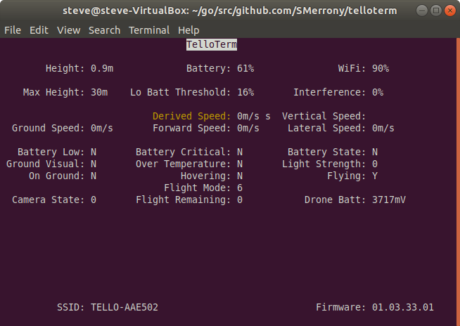

# telloterm
A functioning desktop testbed for flying the Ryze Tello drone via my tello API.

_Play with this entirely at your own risk - it's not the author's fault if you lose your drone
or damage it, or anything else, when using this software._

Telloterm currently provides
* detailed Tello status display
* control from the keyboard
* picture taking
* optional live video feed via mplayer (must be installed separately)
* optional control via a Dualshock 4 game controller or Thrustmaster HotasX flight controller

Only tested on GNU/Linux - it almost certainly won't work as-is on other platforms.

## Install

``go get github.com/SMerrony/telloterm``

If you wish to use the video window you must have mplayer installed and on your PATH.

## Usage
* Centre the throttle control at the mid-position if using a flight controller
* Turn on the Tello
* Wait for it to initialise (flashing orange LED)
* Connect your computer to the Tello WiFi
* Run telloterm from a terminal window

Hit 'v' to start a video feed, an mplayer window should appear. 

To get help type `telloterm -h`

Use the `-joyhelp` option to see the joystick control mappings.  You will need to specify an ID and type to use a joystick.

Use the `-keyhelp` option to see the keyboard control mappings.  Be aware that in keyboard mode Tello motion continues until you
counteract it, or stop the Tello with the space bar.

If you find that mplayer takes over the whole screen (rather than being in its own window), then try the -x11 option which may help.

N.B. To control the Tello the telloterm window must have focus.

Once you have landed the drone, stop the program with the Q key, and photos that have been successfully taken will then be saved
in the current directory.